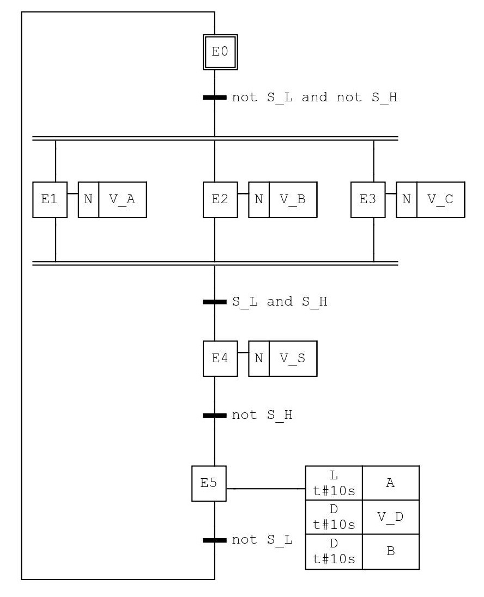
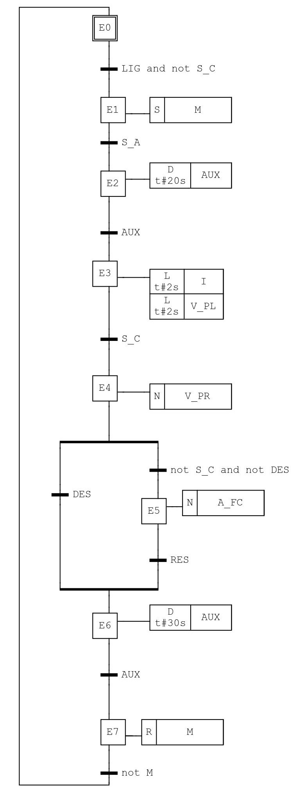
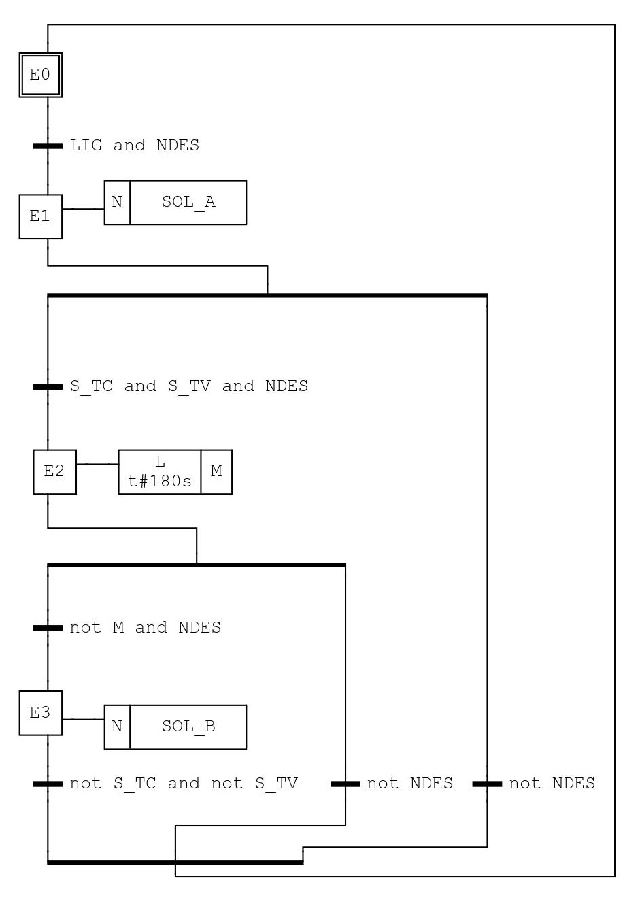

---
title:
- Simulações em Controladores Lógicos Programáveis
author:
- Bruno M. Souza
- Levy G. S. Galvão
numbersections: true
output:
    pdf_document:
        template: NULL
---

<!-- pandoc clp.md -o out.pdf -->

# Tabelas

## Simulação 1

 Tabela 1 - Receptividades da simulação 1.

| Entradas | Nv. comportamental | Nv. tecnológico | Ladder
| - | :-: | :-: | :-: |
| Chave de nível superior | $S_H$ | S_H | I01 |
| Chave de nível inferior | $S_L$ | S_L | I02 |

 Tabela 2 - Saídas da simulação 1.

| Saídas | Nv. comportamental | Nv. tecnológico |  Ladder
| - | :-: | :-: | :-: |
| Válvula do material A | $V_A$ | V_A | Q01 |
| Válvula do material B | $V_B$ | V_B | Q02 |
| Válvula do material C | $V_C$ | V_C | Q03 |
| Válvula de segurança | $V_S$ | V_S | Q04 |
| Válvula de descarga | $V_D$ | V_D | Q05 |
| Bomba | $B$ | B | Q06 |
| Agitador | $A$ | A | Q07 |

 Tabela 3 - Transições da simulação 1.

| Transições | Nv. comportamental | Ladder
| - | :-: | :-: |
| 0 para 123 | $T_{0123}$ | M03 |
| 123 para 4 | $T_{1234}$ | M04 |
| 4 para 5 | $T_{45}$ | M05 |
| 5 para 0 | $T_{50}$ | M06 |

 Tabela 4 - Etapas da simulação 1.

| Transições | Nv. comportamental | Ladder
| - | :-: | :-: |
| Etapa 0 | E0 | M07 |
| Etapa 1 | E1 | M08 |
| Etapa 2 | E2 | M09 |
| Etapa 3 | E3 | M0A |
| Etapa 4 | E4 | M0B |
| Etapa 5 | E5 | M0C |

## Simulação 2

 Tabela 5 - Receptividades da simulação 2.

| Entradas | Nv. comportamental | Nv. tecnológico | Ladder
| - | :-: | :-: | :-: |
| Botão liga | $LIG$ | LIG | I01
| Botão desliga | $DES$ | DES | I02
| Botão de rearme | $RES$ | RES | I03
| Detector de chama | $S_C$ | S_C | I04
| Sensor de fluxo de ar | $S_A$ | S_A | I05

 Tabela 6 - Saídas da simulação 2.

| Saídas | Nv. comportamental | Nv. tecnológico | Ladder
| - | :-: | :-: | :-: |
| Ignitor | $I$ | I | Q01
| Motor ventilador | $M$ | M | Q02
| Válvula principal | $V_{PR}$ | V_PR | Q03
| Válvula piloto | $V_{PL}$ | V_PL | Q04
| Alarme falta-chama | $A_{FC}$ | A_FC | Q05

 Tabela 7 - Transições da simulação 2.

| Transições | Nv. comportamental | Nv. tecnológico 
| - | :-: | :-: |
| O para 1 | $T_{01}$ | M03 |
| 1 para 2 | $T_{12}$ | M04 |
| 2 para 3 | $T_{23}$ | M05 |
| 3 para 4 | $T_{34}$ | M06 |
| 4 para 6 | $T_{46}$ | M07 |
| 4 para 5 | $T_{45}$ | M08 |
| 5 para 6 | $T_{56}$ | M09 |
| 6 para 7 | $T_{67}$ | M0A |
| 7 para 8 | $T_{78}$ | M0B |

 Tabela 8 - Etapas da simulação 2.

| Transições | Nv. comportamental | Nv. tecnológico 
| - | :-: | :-: |
| Etapa 0 | E0 | M0C |
| Etapa 1 | E1 | M0D |
| Etapa 2 | E2 | M0E |
| Etapa 3 | E3 | M0F |
| Etapa 4 | E4 | M10 |
| Etapa 5 | E5 | M11 |
| Etapa 6 | E6 | M12 |
| Etapa 7 | E7 | M13 |

## Simulação 3

 Tabela 9 - Receptividades da simulação 3.

| Entradas | Nv. comportamental | Nv. tecnológico 
| - | :-: | :-: |
| Botão de partida NA | $LIG$ | LIG
| Botão de parada NF | $NDES$ | NDES

 Tabela 10 - Saídas da simulação 3.

| Saídas | Nv. comportamental | Nv. tecnológico 
| - | :-: | :-: |
| Solenoide A | $SOL_A$ | SOL_A |
| Solenoide B | $SOL_B$ | SOL_B |
| Sensor de tanque vazio | $S_{TV}$ | S_TV |
| Sensor de tanque cheio | $S_{TC}$ | S_TC |
| Motor do agitador | $M$ | M |

 Tabela 11 - Transições da simulação 3.

| Transições | Nv. comportamental | Nv. tecnológico 
| - | :-: | :-: |
|  |  |  |

 Tabela 12 - Etapas da simulação 3.

| Transições | Nv. comportamental | Nv. tecnológico 
| - | :-: | :-: |
|  |  |  |

# SFC

 Figura 1 - Simulação 1.

 Figura 2 - Simulação 2.

 Figura 3 - Simulação 3.

# Ladder
