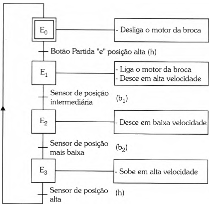
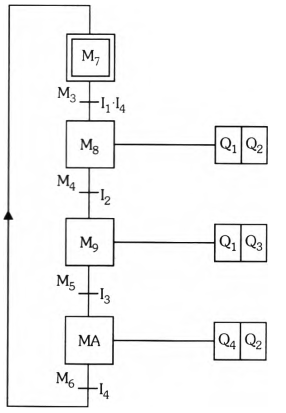

# Conversão Grafcet-Ladder

1) Criação do Grafcet comportamental



2) Criação das tabelas de associação

<center> Tabela 1 - Receptividades.

| Descrição | Nv. comportamental | Nv. tecnológico |
| - | :-: | :-: 
| Botão de partida | $P$ | I1 |
| Sensor da posição intermediária | $b_1$ | I2 | 
| Sensor da posição mais baixa | $b_2$ | I3 |
| Sensor da posição alta | $h$ | I4 |
</center>

<center> Tabela 2 - Etapas.

| Descrição | Nv. comportamental | Nv. tecnológico |
| - | :-: | :-: |
| Etapa 0 | $E_0$ | M7 |
| Etapa 1 | $E_1$ | M8 | 
| Etapa 2 | $E_2$ | M9 |
| Etapa 3 | $E_3$ | MA |
</center>

<center> Tabela 3 - Transições.

| Descrição | Nv. comportamental | Nv. tecnológico |
| - | :-: | :-: |
| Transição entre as etapas 0 e 1 | $T_{01}$ | M3 |
| Transição entre as etapas 1 e 2 | $T_{12}$ | M4 | 
| Transição entre as etapas 2 e 3 | $T_{23}$ | M5 |
| Transição entre as etapas 3 e 0 | $T_{30}$ | M6 |
</center>

<center> Tabela 4 - Saídas.

| Descrição | Nv. comportamental | Nv. tecnológico |
| - | :-: | :-: |
| Motor broca desce | MBD | Q1 | 
| Velocidade alta | MVA | Q2 | 
| Velocidade baixa | MVB | Q3 |
| Motor broca sobe | MBS | Q4 |
</center>

1) Criação do Grafcet tecnológico



4) Criação do programa em Ladder

    - Ativação da etapa inicial:

    ```
    M1 = !M2
    M2 = M2 + !M2
    ```

    - ~~Detecção de bordas~~:

    - Transições:

    ```
    M3 = M7 * I1 * I4
    M4 = M8 * I2
    M5 = M9 * I3
    M6 = MA * I4
    ```

    - Etapas:

        - Set:
            ```
            SM7 = M1 + M6
            SM8 = M3
            SM9 = M4
            SMA = M5 
            ```
        - Reset:
            ```
            RM7 = M3
            RM8 = M4
            RM9 = M5
            RMA = M6
            ```

    - Ações:

    ```
    Q1 = M8 + M9
    Q2 = M8 + MA
    Q3 = M9 
    Q4 = MA
    ```